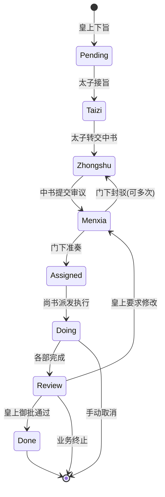

# 三省六部任务分发流转体系 · 业务与技术架构

> 本文档详细阐述「三省六部」项目如何从**业务制度设计**到**代码实现细节**，完整处理复杂多Agent协作的任务分发与流转。这是一个**制度化的AI多Agent框架**，而非传统的自由讨论式协作系统。

**文档概览图**

```
━━━━━━━━━━━━━━━━━━━━━━━━━━━━━━━━━━━━━━━━━━━━━━━━━━━━━━━━━━━━━
业务层：帝国制度 (Imperial Governance Model)
  ├─ 分权制衡：皇上 → 太子 → 中书 → 门下 → 尚书 → 六部
  ├─ 制度约束：不可越级、状态严格递进、门下必审议
  └─ 质量保障：可封驳反工、实时可观测、紧急可干预
━━━━━━━━━━━━━━━━━━━━━━━━━━━━━━━━━━━━━━━━━━━━━━━━━━━━━━━━━━━━━
技术层：Claude Code多Agent编排 (Multi-Agent Orchestration)
  ├─ 状态机：9个状态（Pending → Taizi → Zhongshu → Menxia → Assigned → Doing/Next → Review → Done/Cancelled）
  ├─ 数据融合：flow_log + progress_log + session JSONL → unified activity stream
  ├─ 权限矩阵：严格的subagent调用权限控制
  └─ 调度层：自动派发、超时重试、停滞升级、自动回滚
━━━━━━━━━━━━━━━━━━━━━━━━━━━━━━━━━━━━━━━━━━━━━━━━━━━━━━━━━━━━━
观测层：React 看板 + 实时API (Dashboard + Real-time Analytics)
  ├─ 任务看板：10个视图面板（全部/按状态/按部门/按优先级等）
  ├─ 活动流：59条/任务的混合活动记录（思考过程、工具调用、状态转移）
  └─ 在线状态：Agent 实时节点检测 + 心跳喚醒机制
━━━━━━━━━━━━━━━━━━━━━━━━━━━━━━━━━━━━━━━━━━━━━━━━━━━━━━━━━━━━━
```

---

## 📚 第一部分：业务架构

### 1.1 帝国制度：分权制衡的设计哲学

#### 核心理念

传统的多Agent框架（如CrewAI、AutoGen）采用**"自由协作"模式**：
- Agent自主选择协作对象
- 框架仅提供通信通道
- 质量控制完全依赖Agent智能
- **问题**：容易出现Agent相互制造假数据、重复工作、方案质量无保障

**三省六部**采用**"制度化协作"模式**，模仿古代帝国官僚体系：

```
              皇上
              (User)
               │
               ↓
             太子 (Taizi)
        [分拣官、消息接入总负责]
      ├─ 识别：这是旨意还是闲聊？
      ├─ 执行：直接回复闲聊 || 建立任务→转中书
      └─ 权限：只能调用 中书省
               │
               ↓
           中书省 (Zhongshu)
      [规划官、方案起草总负责]
      ├─ 接旨后分析需求
      ├─ 拆解为子任务（todos）
      ├─ 调用门下省审议 OR 尚书省咨询
      └─ 权限：只能调用 门下 + 尚书
               │
               ↓
           门下省 (Menxia)
        [审议官、质量把握人]
      ├─ 审查中书方案（可行性、完整性、风险）
      ├─ 准奏 OR 封驳（含修改建议）
      ├─ 若封驳 → 返回中书修改 → 重新审议（最多3轮）
      └─ 权限：只能调用 尚书 + 回调中书
               │
         (✅ 准奏)
               │
               ↓
           尚书省 (Shangshu)
        [派发官、执行总指挥]
      ├─ 接到准奏方案
      ├─ 分析派发给哪个部门
      ├─ 调用六部（礼/户/兵/刑/工/吏）执行
      ├─ 监控各部进度 → 汇总结果
      └─ 权限：只能调用 六部（不能越权调中书）
               │
               ├─ 礼部 (Libu)      - 文档编制官
               ├─ 户部 (Hubu)      - 数据分析官
               ├─ 兵部 (Bingbu)    - 代码实现官
               ├─ 刑部 (Xingbu)    - 测试审查官
               ├─ 工部 (Gongbu)    - 基础设施官
               └─ 吏部 (Libu_hr)   - 人力资源官
               │
         (各部并行执行)
               ↓
           尚书省·汇总
      ├─ 收集六部结果
      ├─ 状态转为 Review
      ├─ 回调中书省转报皇上
               │
               ↓
           中书省·回奏
      ├─ 汇总现象、结论、建议
      ├─ 状态转为 Done
      └─ 回复飞书消息给皇上
```

#### 制度的4大保障

| 保障机制 | 实现细节 | 防护效果 |
|---------|---------|---------|
| **制度性审核** | 门下省必审议所有中书方案，不可跳过 | 防止Agent胡乱执行，确保方案具有可行性 |
| **分权制衡** | 权限矩阵：谁能调谁严格定义 | 防止权力滥用（如尚书越权调中书改方案） |
| **完全可观测** | 任务看板10个面板 + 59条活动/任务 | 实时看到任务卡在哪、谁在工作、工作状态如何 |
| **实时可干预** | 看板内一键 stop/cancel/resume/advance | 紧急情况（如发现Agent走错方向）能立即纠正 |

---

### 1.2 任务完整流转流程

#### 流程示意图



#### 具体关键路径

**✅ 理想路径**（无阻滞，4-5天完成）

```
DAY 1:
  10:00 - 皇上飞书："为三省六部编写完整自动化测试方案"
          太子接旨。state = Taizi, org = 太子
          自动派发 taizi agent → 处理此旨意
  
  10:30 - 太子分拣完毕。判定为「工作旨意」（非闲聊）
          建任务 JJC-20260228-E2E
          flow_log 记录："皇上 → 太子：下旨"
          state: Taizi → Zhongshu, org: 太子 → 中书省
          自动派发 zhongshu agent

DAY 2:
  09:00 - 中书省接旨。开始规划
          汇报进展："分析测试需求，拆解为单元/集成/E2E三层"
          progress_log 记录："中书省 张三：分需求"
          
  15:00 - 中书省完成方案
          todos 快照：需求分析✅、方案设计✅、待审议🔄
          flow_log 记录："中书省 → 门下省：方案提交审议"
          state: Zhongshu → Menxia, org: 中书省 → 门下省
          自动派发 menxia agent

DAY 3:
  09:00 - 门下省开始审议
          进度汇报："现在审查方案的完整性和风险"
          
  14:00 - 门下省审议完毕
          判定："方案可行，但缺失 _infer_agent_id_from_runtime 函数的测试"
          行为：✅ 准奏 (带修改建议)
          flow_log 记录："门下省 → 尚书省：✅ 准奏通过（5条建议）"
          state: Menxia → Assigned, org: 门下省 → 尚书省
          OPTIONAL：中书省收到建议，主动优化方案
          自动派发 shangshu agent

DAY 4:
  10:00 - 尚书省接到准奏
          分析："该测试方案应派给工部+刑部+礼部协力完成"
          flow_log 记录："尚书省 → 六部：派发执行（兵吏合作）"
          state: Assigned → Doing, org: 尚书省 → 兵部+刑部+礼部
          自动派发 bingbu/xingbu/libu 三个agent（并行）

DAY 4-5:
  (各部并行执行)
  - 兵部(bingbu)：实现 pytest + unittest 测试框架
  - 刑部(xingbu)：编写测试覆盖所有关键函数
  - 礼部(libu)：整理测试文档和用例说明
  
  实时汇报（hourly progress）：
  - 兵部："✅ 已实现 16 个单元测试"
  - 刑部："🔄 正在编写集成测试（8/12 完成）"
  - 礼部："等待兵部完成再写报告"

DAY 5:
  14:00 - 各部完成
          state: Doing → Review, org: 兵部 → 尚书省
          尚书省汇总："所有测试已完成，通过率 98.5%"
          转回中书省
          
  15:00 - 中书省回奏皇上
          state: Review → Done
          模板回复飞书，含最终成果链接和总结
```

**❌ 挫折路径**（含封驳和重试，6-7天）

```
DAY 2 同上

DAY 3 [封驳场景]：
  14:00 - 门下省审议完毕
          判定："方案不完整，缺少性能测试 + 压力测试"
          行为：🚫 封驳
          review_round += 1
          flow_log 记录："门下省 → 中书省：🚫 封驳（需补充性能测试）"
          state: Menxia → Zhongshu  # 返回中书修改
          自动派发 zhongshu agent（重新规划）

DAY 3-4：
  16:00 - 中书省收到封驳通知（唤醒agent）
          分析改进意见，补充性能测试方案
          progress："已整合性能测试需求，修正方案如下..."
          flow_log 记录："中书省 → 门下省：修订方案（第2轮审议）"
          state: Zhongshu → Menxia
          自动派发 menxia agent

  18:00 - 门下省重新审议
          判定："✅ 本次通过"
          flow_log 记录："门下省 → 尚书省：✅ 准奏通过（第2轮）"
          state: Menxia → Assigned → Doing
          后续同理想路径...

DAY 7：全部完成（比理想路径晚1-2天）
```

---

### 1.3 任务规格书与业务契约

#### Task Schema 字段说明

```json
{
  "id": "JJC-20260228-E2E",          // 任务全局唯一ID (JJC-日期-序号)
  "title": "为三省六部编写完整自动化测试方案",
  "official": "中书令",              // 负责官职
  "org": "中书省",                   // 当前负责部门
  "state": "Assigned",               // 当前状态（见 _STATE_FLOW）
  
  // ──── 质量与约束 ────
  "priority": "normal",              // 优先级：critical/high/normal/low
  "block": "无",                     // 当前阻滞原因（如"等待工部反馈"）
  "reviewRound": 2,                  // 门下审议第几轮
  "_prev_state": "Menxia",           // 若被 stop，记录之前状态用于 resume
  
  // ──── 业务产出 ────
  "output": "",                      // 最终任务成果（URL/文件路径/总结）
  "ac": "",                          // Acceptance Criteria（验收标准）
  "priority": "normal",
  
  // ──── 流转记录 ────
  "flow_log": [
    {
      "at": "2026-02-28T10:00:00Z",
      "from": "皇上",
      "to": "太子",
      "remark": "下旨：为三省六部编写完整自动化测试方案"
    },
    {
      "at": "2026-02-28T10:30:00Z",
      "from": "太子",
      "to": "中书省",
      "remark": "分拣→传旨"
    },
    {
      "at": "2026-02-28T15:00:00Z",
      "from": "中书省",
      "to": "门下省",
      "remark": "规划方案提交审议"
    },
    {
      "at": "2026-03-01T09:00:00Z",
      "from": "门下省",
      "to": "中书省",
      "remark": "🚫 封驳：需补充性能测试"
    },
    {
      "at": "2026-03-01T15:00:00Z",
      "from": "中书省",
      "to": "门下省",
      "remark": "修订方案（第2轮审议）"
    },
    {
      "at": "2026-03-01T20:00:00Z",
      "from": "门下省",
      "to": "尚书省",
      "remark": "✅ 准奏通过（第2轮，5条建议已采纳）"
    }
  ],
  
  // ──── Agent 实时汇报 ────
  "progress_log": [
    {
      "at": "2026-02-28T10:35:00Z",
      "agent": "zhongshu",              // 汇报agent
      "agentLabel": "中书省",
      "text": "已接旨。分析测试需求，拟定三层测试方案...",
      "state": "Zhongshu",              // 汇报时的状态快照
      "org": "中书省",
      "tokens": 4500,                   // 资源消耗
      "cost": 0.0045,
      "elapsed": 120,
      "todos": [                        // 待办任务快照
        {"id": "1", "title": "需求分析", "status": "completed"},
        {"id": "2", "title": "方案设计", "status": "in-progress"},
        {"id": "3", "title": "await审议", "status": "not-started"}
      ]
    },
    // ... 更多 progress_log 条目 ...
  ],
  
  // ──── 调度元数据 ────
  "_scheduler": {
    "enabled": true,
    "stallThresholdSec": 180,         // 停滞超过180秒自动升级
    "maxRetry": 1,                    // 自动重试最多1次
    "retryCount": 0,
    "escalationLevel": 0,             // 0=无升级 1=门下协调 2=尚书协调
    "lastProgressAt": "2026-03-01T20:00:00Z",
    "stallSince": null,               // 何时开始停滞
    "lastDispatchStatus": "success",  // queued|success|failed|timeout|error
    "snapshot": {
      "state": "Assigned",
      "org": "尚书省",
      "note": "review-before-approve"
    }
  },
  
  // ──── 生命周期 ────
  "archived": false,                 // 是否归档
  "now": "门下省准奏，移交尚书省派发",  // 当前实时状态描述
  "updatedAt": "2026-03-01T20:00:00Z"
}
```

#### 业务契约

| 契约 | 含义 | 违反后果 |
|------|------|---------|
| **不可越级** | 太子只能调中书，中书只能调门下/尚书，六部不能对外调用 | 超权调用被拒绝，系统自动拦截 |
| **状态单向递进** | Pending → Taizi → Zhongshu → ... → Done，不能跳过或倒退 | 只能通过 review_action(reject) 返回上一步 |
| **门下必审** | 所有中书提出的方案都要门下省审议，无法跳过 | 中书不能直接转尚书，门下必入 |
| **一旦Done无改** | 任务进入Done/Cancelled后不能再修改状态 | 若需修改需要创建新任务或取消后重新建 |
| **task_id唯一性** | JJC-日期-序号 全局唯一，同一天同一任务不重复建 | 看板防重，自动去重 |
| **资源消耗透明** | 每次进展汇报都要上报 tokens/cost/elapsed | 便于成本核算和性能优化 |

---

## 🔧 第二部分：技术架构

### 2.1 状态机与自动派发

#### 状态转移完整定义

```python
_STATE_FLOW = {
    'Pending':  ('Taizi',   '皇上',    '太子',    '待处理旨意转交太子分拣'),
    'Taizi':    ('Zhongshu','太子',    '中书省',  '太子分拣完毕，转中书省起草'),
    'Zhongshu': ('Menxia',  '中书省',  '门下省',  '中书省方案提交门下省审议'),
    'Menxia':   ('Assigned','门下省',  '尚书省',  '门下省准奏，转尚书省派发'),
    'Assigned': ('Doing',   '尚书省',  '六部',    '尚书省开始派发执行'),
    'Next':     ('Doing',   '尚书省',  '六部',    '待执行任务开始执行'),
    'Doing':    ('Review',  '六部',    '尚书省',  '各部完成，进入汇总'),
    'Review':   ('Done',    '尚书省',  '太子',    '全流程完成，回奏太子转报皇上'),
}
```

每个状态自动关联 Agent ID（见 `_STATE_AGENT_MAP`）：

```python
_STATE_AGENT_MAP = {
    'Taizi':    'taizi',
    'Zhongshu': 'zhongshu',
    'Menxia':   'menxia',
    'Assigned': 'shangshu',
    'Doing':    None,      # 从 org 推断（六部之一）
    'Next':     None,      # 从 org 推断
    'Review':   'shangshu',
    'Pending':  'zhongshu',
}
```

#### 自动派发流程

当任务状态转移时（通过 `handle_advance_state()` 或审批），后台自动执行派发：

```
1. 状态转移触发派发
   ├─ 查表 _STATE_AGENT_MAP 得到目标 agent_id
   ├─ 若是 Doing/Next，从 task.org 查表 _ORG_AGENT_MAP 推断具体部门agent
   └─ 若无法推断则跳过派发（如 Done/Cancelled）

2. 构造派发消息（针对性促使Agent立即工作）
   ├─ taizi: "📜 皇上旨意需要你处理..."
   ├─ zhongshu: "📜 旨意已到中书省，请起草方案..."
   ├─ menxia: "📋 中书省方案提交审议..."
   ├─ shangshu: "📮 门下省已准奏，请派发执行..."
   └─ 六部: "📌 请处理任务..."

3. 后台异步派发（非阻塞）
   ├─ spawn daemon thread
   ├─ 标记 _scheduler.lastDispatchStatus = 'queued'
   ├─ 检查 Gateway 进程是否开启
   ├─ 运行 claude -p --agent {id} "{msg}"
   ├─ 重试最多2次（失败间隔5秒退避）
   ├─ 更新 _scheduler 状态和错误信息
   └─ flow_log 记录派发结果

4. 派发状态转移
   ├─ success: 立即更新 _scheduler.lastDispatchStatus = 'success'
   ├─ failed: 记录失败原因，Agent 超时不会 block 看板
   ├─ timeout: 标记 timeout，允许用户手动重试 / 升级
   ├─ gateway-offline: Gateway 未启动，跳过此次派发（后续可重试）
   └─ error: 异常情况，记录堆栈供调试

5. 到达目标Agent的处理
   ├─ Agent 从飞书消息收到通知
   ├─ 通过 kanban_update.py 与看板交互（更新状态/记录进展）
   └─ 完成工作后再次触发派发到下一个Agent
```

---

### 2.2 权限矩阵与Subagent调用

#### 权限定义（.claude/settings.json 中配置）

```json
{
  "agents": [
    {
      "id": "taizi",
      "label": "太子",
      "allowAgents": ["zhongshu"]
    },
    {
      "id": "zhongshu",
      "label": "中书省",
      "allowAgents": ["menxia", "shangshu"]
    },
    {
      "id": "menxia",
      "label": "门下省",
      "allowAgents": ["shangshu", "zhongshu"]
    },
    {
      "id": "shangshu",
      "label": "尚书省",
      "allowAgents": ["libu", "hubu", "bingbu", "xingbu", "gongbu", "libu_hr"]
    },
    {
      "id": "libu",
      "label": "礼部",
      "allowAgents": []
    },
    // ... 其他六部同样 allowAgents = [] ...
  ]
}
```

#### 权限检查机制（代码层面）

在 `dispatch_for_state()` 之外，还有一套防御性的权限检查：

```python
def can_dispatch_to(from_agent, to_agent):
    """检查 from_agent 是否有权调用 to_agent。"""
    cfg = read_json(DATA / 'agent_config.json', {})
    agents = cfg.get('agents', [])
    
    from_record = next((a for a in agents if a.get('id') == from_agent), None)
    if not from_record:
        return False, f'{from_agent} 不存在'
    
    allowed = from_record.get('allowAgents', [])
    if to_agent not in allowed:
        return False, f'{from_agent} 无权调用 {to_agent}（允许列表：{allowed}）'
    
    return True, 'OK'
```

#### 权限违反示例与处理

| 场景 | 请求 | 结果 | 理由 |
|------|------|------|------|
| **正常** | 中书省 → 门下省审议 | ✅ 允许 | 门下在中书的 allowAgents 中 |
| **违反** | 中书省 → 尚书省改方案 | ❌ 拒绝 | 中书只能调门下/尚书，不能手工改尚书工作 |
| **违反** | 工部 → 尚书省 "我完成了" | ✅ 改状态 | 通过 flow_log 和 progress_log（不是跨Agent调用） |
| **违反** | 尚书省 → 中书省 "重新改方案" | ❌ 拒绝 | 尚书不在门下/中书的 allowAgents 中 |
| **防控** | Agent 伪造其他agent派发 | ❌ 拦截 | API 层验证 HTTP 请求来源/签名 |

---

### 2.3 数据融合：progress_log + session JSONL

#### 现象

当任务执行时，有三层数据源：

```
1️⃣ flow_log
   └─ 纯粹记录状态转移（Zhongshu → Menxia）
   └─ 数据源：任务 JSON 的 flow_log 字段
   └─ 来自：Agent 通过 kanban_update.py flow 命令上报

2️⃣ progress_log
   └─ Agent 的实时工作汇报（文本进展、todos快照、资源消耗）
   └─ 数据源：任务 JSON 的 progress_log 字段
   └─ 来自：Agent 通过 kanban_update.py progress 命令上报
   └─ 周期：通常每30分钟或关键节点上报1次

3️⃣ session JSONL（新增！）
   └─ Agent 的内部思考过程（thinking）、工具调用（tool_result）、对话历史（user）
   └─ 数据源：~/.claude/agents/{agent_id}/sessions/*.jsonl
   └─ 来自：Claude Code框架自动记录，Agent无需主动操作
   └─ 周期：消息级别，粒度最细
```

#### 问题诊断

过去，只靠 flow_log + progress_log 展现进展：
- ❌ 看不到Agent的具体思考过程
- ❌ 看不到每次工具调用的结果
- ❌ 看不到Agent中间的对话历史
- ❌ Agent 表现出"黑盒状态"

例如：progress_log 记录"正在分析需求"，但用户看不到到底分析了什么。

#### 解决方案：Session JSONL 融合

在 `get_task_activity()` 中新增融合逻辑（40行）：

```python
def get_task_activity(task_id):
    # ... 前面代码同上 ...
    
    # ── 融合 Agent Session 活动（thinking / tool_result / user）──
    session_entries = []
    
    # 活跃任务：尝试按 task_id 精确匹配
    if state not in ('Done', 'Cancelled'):
        if agent_id:
            entries = get_agent_activity(
                agent_id, limit=30, task_id=task_id
            )
            session_entries.extend(entries)
        
        # 也从相关Agent获取
        for ra in related_agents:
            if ra != agent_id:
                entries = get_agent_activity(
                    ra, limit=20, task_id=task_id
                )
                session_entries.extend(entries)
    else:
        # 已完成任务：基于关键词匹配
        title = task.get('title', '')
        keywords = _extract_keywords(title)
        if keywords:
            for ra in related_agents[:5]:
                entries = get_agent_activity_by_keywords(
                    ra, keywords, limit=15
                )
                session_entries.extend(entries)
    
    # 去重（通过 at+kind 去重避免重复）
    existing_keys = {(a.get('at', ''), a.get('kind', '')) for a in activity}
    for se in session_entries:
        key = (se.get('at', ''), se.get('kind', ''))
        if key not in existing_keys:
            activity.append(se)
            existing_keys.add(key)
    
    # 重新排序
    activity.sort(key=lambda x: x.get('at', ''))
    
    # 返回时标记数据来源
    return {
        'activity': activity,
        'activitySource': 'progress+session',  # 新标记
        # ... 其他字段 ...
    }
```

#### Session JSONL 格式解析

从 JSONL 中提取的条目，统一转换为看板活动条目：

```python
def _parse_activity_entry(item):
    """将 session jsonl 的 message 统一解析成看板活动条目。"""
    msg = item.get('message', {})
    role = str(msg.get('role', '')).strip().lower()
    ts = item.get('timestamp', '')
    
    # 🧠 Assistant 角色 - Agent思考过程
    if role == 'assistant':
        entry = {
            'at': ts,
            'kind': 'assistant',
            'text': '...主回复...',
            'thinking': '💭 Agent考虑到...',  # 内部思维链
            'tools': [
                {'name': 'bash', 'input_preview': 'cd /src && npm test'},
                {'name': 'file_read', 'input_preview': 'dashboard/server.py'},
            ]
        }
        return entry
    
    # 🔧 Tool Result - 工具调用结果
    if role in ('toolresult', 'tool_result'):
        entry = {
            'at': ts,
            'kind': 'tool_result',
            'tool': 'bash',
            'exitCode': 0,
            'output': '✓ All tests passed (123 tests)',
            'durationMs': 4500  # 执行时长
        }
        return entry
    
    # 👤 User - 人工反馈或对话
    if role == 'user':
        entry = {
            'at': ts,
            'kind': 'user',
            'text': '请实现测试用例的异常处理'
        }
        return entry
```

#### 融合后的活动流结构

单个任务的59条活动流（JJC-20260228-E2E 示例）：

```
kind    count  代表事件
────────────────────────────────────────────────
flow      10   状态转移链（Pending→Taizi→Zhongshu→...）
progress  11   Agent工作汇报（"正在分析"、"已完成"）
todos     11   待办任务快照（进度更新时每条）
user       1   用户反馈（如"需要补充性能测试"）
assistant 10   Agent思考过程（💭 reasoning chain）
tool_result 16   工具调用记录（bash运行结果、API调用结果）
────────────────────────────────────────────────
总计      59   完整工作轨迹
```

看板展示时，用户可以：
- 📋 看流转链了解任务在哪个阶段
- 📝 看 progress 了解Agent实时说了什么
- ✅ 看 todos 了解任务拆解和完成进度
- 💭 看 assistant/thinking 了解Agent的思考过程
- 🔧 看 tool_result 了解每次工具调用的结果
- 👤 看 user 了解是否有人工干预

---

### 2.4 调度系统：超时重试、停滞升级、自动回滚

#### 调度元数据结构

```python
_scheduler = {
    # 配置参数
    'enabled': True,
    'stallThresholdSec': 180,         # 停滞多久后自动升级（默认180秒）
    'maxRetry': 1,                    # 自动重试次数（0=不重试，1=重试1次）
    'autoRollback': True,             # 是否自动回滚到快照
    
    # 运行时状态
    'retryCount': 0,                  # 当前已重试几次
    'escalationLevel': 0,             # 0=无升级 1=门下协调 2=尚书协调
    'stallSince': None,               # 何时开始停滞的时间戳
    'lastProgressAt': '2026-03-01T...',  # 最后一次获得进展的时间
    'lastEscalatedAt': '2026-03-01T...',
    'lastRetryAt': '2026-03-01T...',
    
    # 派发追踪
    'lastDispatchStatus': 'success',  # queued|success|failed|timeout|gateway-offline|error
    'lastDispatchAgent': 'zhongshu',
    'lastDispatchTrigger': 'state-transition',
    'lastDispatchError': '',          # 错误堆栈（如有）
    
    # 快照（用于自动回滚）
    'snapshot': {
        'state': 'Assigned',
        'org': '尚书省',
        'now': '等待派发...',
        'savedAt': '2026-03-01T...',
        'note': 'scheduled-check'
    }
}
```

#### 调度算法

每 60 秒运行一次 `handle_scheduler_scan(threshold_sec=180)`：

```
FOR EACH 任务:
  IF state in (Done, Cancelled, Blocked):
    SKIP  # 终态不处理
  
  elapsed_since_progress = NOW - lastProgressAt
  
  IF elapsed_since_progress < stallThreshold:
    SKIP  # 最近有进展，无需处理
  
  # ── 停滞处理逻辑 ──
  IF retryCount < maxRetry:
    ✅ 执行【重试】
    - increment retryCount
    - dispatch_for_state(task, new_state, trigger='taizi-scan-retry')
    - flow_log: "停滞180秒，触发自动重试第N次"
    - NEXT task
  
  IF escalationLevel < 2:
    ✅ 执行【升级】
    - nextLevel = escalationLevel + 1
    - target_agent = menxia (if L=1) else shangshu (if L=2)
    - wake_agent(target_agent, "💬 任务停滞，请介入协调推进")
    - flow_log: "升级至{target_agent}协调"
    - NEXT task
  
  IF escalationLevel >= 2 AND autoRollback:
    ✅ 执行【自动回滚】
    - restore task to snapshot.state
    - retryCount = 0
    - escalationLevel = 0
    - dispatch_for_state(task, snapshot.state, trigger='taiji-auto-rollback')
    - flow_log: "连续停滞，自动回滚到{snapshot.state}"
```

#### 示例场景

**场景：中书省Agent进程崩溃，任务卡在 Zhongshu**

```
T+0:
  中书省正在规划方案
  lastProgressAt = T
  dispatch status = success

T+30:
  Agent 进程意外崩溃（或超载无响应）
  lastProgressAt 仍然 = T（没有新的 progress）

T+60:
  scheduler_scan 扫一遍，发现：
  elapsed = 60 < 180，跳过

T+180:
  scheduler_scan 扫一遍，发现：
  elapsed = 180 >= 180，触发处理
  
  ✅ 阶段1：重试
  - retryCount: 0 → 1
  - dispatch_for_state('JJC-20260228-E2E', 'Zhongshu', trigger='taizi-scan-retry')
  - 派发消息发送到中书省（唤醒agent或重启）
  - flow_log: "停滞180秒，自动重试第1次"

T+ 240:
  中书省 Agent 恢复（或手工重启），收到重试派发
  汇报进展："已恢复，继续规划..."
  lastProgressAt 更新为 T+240
  retryCount 重置为 0
  
  ✓ 问题解决

T+360 (若仍未恢复):
  scheduler_scan 再次扫，发现：
  elapsed = 360 >= 180, retryCount 已经 = 1
  
  ✅ 阶段2：升级
  - escalationLevel: 0 → 1
  - wake_agent('menxia', "💬 任务JJC-20260228-E2E停滞，中书省无反应，请介入")
  - flow_log: "升级至门下省协调"
  
  门下省Agent被唤醒，可以：
  - 检查中书省是否在线
  - 若在线，询问进度
  - 若离线，可能启动应急流程（如由门下暂代起草）

T+540 (若仍未解决):
  scheduler_scan 再次扫，发现：
  escalationLevel = 1, 还能升级到 2
  
  ✅ 阶段3：再次升级
  - escalationLevel: 1 → 2
  - wake_agent('shangshu', "💬 任务长期停滞，中书省+门下省都无法推进，尚书省请介入协调")
  - flow_log: "升级至尚书省协调"

T+720 (若仍未解决):
  scheduler_scan 再次扫，发现：
  escalationLevel = 2（已最大），autoRollback = true
  
  ✅ 阶段4：自动回滚
  - snapshot.state = 'Assigned' (前一个稳定状态)
  - task.state: Zhongshu → Assigned
  - dispatch_for_state('JJC-20260228-E2E', 'Assigned', trigger='taizi-auto-rollback')
  - flow_log: "连续停滞，自动回滚到Assigned，由尚书省重新派发"
  
  结果：
  - 尚书省重新派发给六部执行
  - 中书省的方案保留在前一个 snapshot 版本中
  - 用户可以看到回滚操作，决定是否介入
```

---

## 🎯 第三部分：核心API与CLI工具

### 3.1 任务操作API端点

#### 任务创建：`POST /api/create-task`

```
请求：
{
  "title": "为三省六部编写完整自动化测试方案",
  "org": "中书省",           // 可选，默认太子
  "official": "中书令",      // 可选
  "priority": "normal",
  "template_id": "test_plan", // 可选
  "params": {},
  "target_dept": "兵部+刑部"  // 可选，派发建议
}

响应：
{
  "ok": true,
  "taskId": "JJC-20260228-001",
  "message": "旨意 JJC-20260228-001 已下达，正在派发给太子"
}
```

#### 任务活动流：`GET /api/task-activity/{task_id}`

```
请求：
GET /api/task-activity/JJC-20260228-E2E

响应：
{
  "ok": true,
  "taskId": "JJC-20260228-E2E",
  "taskMeta": {
    "title": "为三省六部编写完整自动化测试方案",
    "state": "Assigned",
    "org": "尚书省",
    "output": "",
    "block": "无",
    "priority": "normal"
  },
  "agentId": "shangshu",
  "agentLabel": "尚书省",
  
  // ── 完整活动流（59条示例）──
  "activity": [
    // flow_log (10条)
    {
      "at": "2026-02-28T10:00:00Z",
      "kind": "flow",
      "from": "皇上",
      "to": "太子",
      "remark": "下旨：为三省六部编写完整自动化测试方案"
    },
    // progress_log (11条)
    {
      "at": "2026-02-28T10:35:00Z",
      "kind": "progress",
      "text": "已接旨。分析测试需求，拟定三层测试方案...",
      "agent": "zhongshu",
      "agentLabel": "中书省",
      "state": "Zhongshu",
      "org": "中书省",
      "tokens": 4500,
      "cost": 0.0045,
      "elapsed": 120
    },
    // todos (11条)
    {
      "at": "2026-02-28T15:00:00Z",
      "kind": "todos",
      "items": [
        {"id": "1", "title": "需求分析", "status": "completed"},
        {"id": "2", "title": "方案设计", "status": "in-progress"},
        {"id": "3", "title": "await审议", "status": "not-started"}
      ],
      "agent": "zhongshu",
      "diff": {
        "changed": [{"id": "2", "from": "not-started", "to": "in-progress"}],
        "added": [],
        "removed": []
      }
    },
    // session活动 (26条总计)
    // - assistant (10条)
    {
      "at": "2026-02-28T14:23:00Z",
      "kind": "assistant",
      "text": "基于需求，我建议采用三层测试架构：\n1. 单元测试覆盖核心函数\n2. 集成测试覆盖API端点\n3. E2E测试覆盖完整流程",
      "thinking": "💭 考虑到项目的复杂性，需要覆盖七个Agent的交互逻辑。单元测试应该采用pytest，集成测试用server.py启动后的HTTP测试...",
      "tools": [
        {"name": "bash", "input_preview": "find . -name '*.py' -type f | wc -l"},
        {"name": "file_read", "input_preview": "dashboard/server.py (first 100 lines)"}
      ]
    },
    // - tool_result (16条)
    {
      "at": "2026-02-28T14:24:00Z",
      "kind": "tool_result",
      "tool": "bash",
      "exitCode": 0,
      "output": "83",
      "durationMs": 450
    }
  ],
  
  "activitySource": "progress+session",
  "relatedAgents": ["taizi", "zhongshu", "menxia"],
  "phaseDurations": [
    {
      "phase": "太子",
      "durationText": "30分",
      "ongoing": false
    },
    {
      "phase": "中书省",
      "durationText": "4小时32分",
      "ongoing": false
    },
    {
      "phase": "门下省",
      "durationText": "1小时15分",
      "ongoing": false
    },
    {
      "phase": "尚书省",
      "durationText": "4小时10分",
      "ongoing": true
    }
  ],
  "totalDuration": "10小时27分",
  "todosSummary": {
    "total": 3,
    "completed": 2,
    "inProgress": 1,
    "notStarted": 0,
    "percent": 67
  },
  "resourceSummary": {
    "totalTokens": 18500,
    "totalCost": 0.0187,
    "totalElapsedSec": 480
  }
}
```

#### 状态推进：`POST /api/advance-state/{task_id}`

```
请求：
{
  "comment": "任务分明该推进了"
}

响应：
{
  "ok": true,
  "message": "JJC-20260228-E2E 已推进到下一阶段 (已自动派发 Agent)",
  "oldState": "Zhongshu",
  "newState": "Menxia",
  "targetAgent": "menxia"
}
```

#### 审批操作：`POST /api/review-action/{task_id}`

```
请求（准奏）：
{
  "action": "approve",
  "comment": "方案可行，已采纳改进建议"
}

OR 请求（封驳）：
{
  "action": "reject",
  "comment": "需补充性能测试，第N轮审议"
}

响应：
{
  "ok": true,
  "message": "JJC-20260228-E2E 已准奏 (已自动派发 Agent)",
  "state": "Assigned",
  "reviewRound": 1
}
```

---

### 3.2 CLI工具：kanban_update.py

Agent 通过此工具与看板交互，共7个命令：

#### 命令1：创建任务（太子或中书手工）

```bash
python3 scripts/kanban_update.py create \
  JJC-20260228-E2E \
  "为三省六部编写完整自动化测试方案" \
  Zhongshu \
  中书省 \
  中书令

# 说明：通常不需要手工运行（看板API自动触发），除非debug
```

#### 命令2：更新状态

```bash
python3 scripts/kanban_update.py state \
  JJC-20260228-E2E \
  Menxia \
  "方案提交门下省审议"

# 说明：
# - 第一个参数：task_id
# - 第二个参数：新状态（Pending/Taizi/Zhongshu/...）
# - 第三个参数：可选，描述信息（会记录到 now 字段）
# 
# 效果：
# - task.state = Menxia
# - task.org 自动推断为 "门下省"
# - 触发派发 menxia agent
# - flow_log 记录转移
```

#### 命令3：添加流转记录

```bash
python3 scripts/kanban_update.py flow \
  JJC-20260228-E2E \
  "中书省" \
  "门下省" \
  "📋 方案提交审核，请审议"

# 说明：
# - 参数1：task_id
# - 参数2：from_dept（谁在上报）
# - 参数3：to_dept（流转到谁）
# - 参数4：remark（备注，可包含emoji）
#
# 注意：只是记录 flow_log，不改变 task.state
#（多用于细节流转，如部门间的协调）
```

#### 命令4：实时进展汇报（重点！）

```bash
python3 scripts/kanban_update.py progress \
  JJC-20260228-E2E \
  "已完成需求分析和方案初稿，现正征询工部意见" \
  "1.需求分析✅|2.方案设计✅|3.工部咨询🔄|4.待门下审议"

# 说明：
# - 参数1：task_id
# - 参数2：进展文本说明
# - 参数3：todos 当前快照（用 | 分隔各项，支持emoji）
#
# 效果：
# - progress_log 添加新条目：
#   {
#     "at": now_iso(),
#     "agent": inferred_agent_id,
#     "text": "已完成需求分析和方案初稿，现正征询工部意见",
#     "state": task.state,
#     "org": task.org,
#     "todos": [
#       {"id": "1", "title": "需求分析", "status": "completed"},
#       {"id": "2", "title": "方案设计", "status": "completed"},
#       {"id": "3", "title": "工部咨询", "status": "in-progress"},
#       {"id": "4", "title": "待门下审议", "status": "not-started"}
#     ],
#     "tokens": (自动从 claude 会话数据读取),
#     "cost": (自动计算),
#     "elapsed": (自动计算)
#   }
#
# 看板效果：
# - 即时渲染为活动条目
# - todos 进度条更新（67% 完成）
# - 资源消耗累加显示
```

#### 命令5：任务完成

```bash
python3 scripts/kanban_update.py done \
  JJC-20260228-E2E \
  "https://github.com/org/repo/tree/feature/auto-test" \
  "自动化测试方案已完成，涵盖单元/集成/E2E三层，通过率98.5%"

# 说明：
# - 参数1：task_id
# - 参数2：output URL（可以是代码仓库、文档链接等）
# - 参数3：最终总结
#
# 效果：
# - task.state = Done（从 Review 推进）
# - task.output = "https://..."
# - 自动发送Feishu消息给皇上（太子转报）
# - flow_log 记录完成转移
```

#### 命令6 & 7：停止/取消任务

```bash
# 叫停（随时可恢复）
python3 scripts/kanban_update.py stop \
  JJC-20260228-E2E \
  "等待工部反馈继续"

# 说明：
# - task.state 暂存（_prev_state）
# - task.block = "等待工部反馈继续"
# - 看板显示 "⏸️ 已叫停"
#
# 恢复：
python3 scripts/kanban_update.py resume \
  JJC-20260228-E2E \
  "工部已反馈，继续执行"
#
# - task.state 恢复到 _prev_state
# - 重新派发 agent

# 取消（不可恢复）
python3 scripts/kanban_update.py cancel \
  JJC-20260228-E2E \
  "业务需求变更，任务作废"
#
# - task.state = Cancelled
# - flow_log 记录取消原因
```

---

## 💡 第四部分：对标与对比

### CrewAI / AutoGen 的传统方式 vs 三省六部的制度化方式

| 维度 | CrewAI | AutoGen | **三省六部** |
|------|--------|---------|----------|
| **协作模式** | 自由讨论（Agent自主选择协作对象） | 面板+回调（Human-in-the-loop） | **制度化协作（权限矩阵+状态机）** |
| **质量保障** | 依赖Agent智能（无审核）| Human审核（频繁中断） | **自动审核（门下省必审）+可干预** |
| **权限控制** | ❌ 无 | ⚠️ Hard-coded | **✅ 配置化权限矩阵** |
| **可观测性** | 低（Agent消息黑盒） | 中（Human看到对话）| **极高（59条活动/任务）** |
| **可干预性** | ❌ 无（跑起来后很难叫停） | ✅ 有（需要人工批准） | **✅ 有（一键stop/cancel/advance）** |
| **任务分发** | 不确定（Agent自主选） | 确定（Human手工分） | **自动确定（权限矩阵+状态机）** |
| **吞吐量** | 1任务1Agent（串行讨论） | 1任务1Team（需人工管理） | **多任务并行（六部同时执行）** |
| **失败恢复** | ❌（重新开始） | ⚠️（需人工调试） | **✅（自动重试3阶段）** |
| **成本控制** | 不透明（没有成本上限）| 中等（Human可叫停） | **透明（每条progress上报成本）** |

### 业务契约的严格性

**CrewAI 的"温和"方式**
```python
# Agent可以自由选择下一步工作
if task_seems_done:
    # Agent自己决定要不要报告给其他Agent
    send_message_to_someone()  # 可能发错人，可能重复
```

**三省六部的"严格"方式**
```python
# 任务状态严格受限，下一步由系统决定
if task.state == 'Zhongshu' and agent_id == 'zhongshu':
    # 只能做Zhongshu该做的事（起草方案）
    deliver_plan_to_menxia()
    
    # 状态转移只能通过API，不能绕过
    # 中书不能直接转尚书，必须经过门下审议
    
    # 若想绕过门下审议
    try:
        dispatch_to(shangshu)  # ❌ 权限检查拦截
    except PermissionError:
        log.error(f'zhongshu 无权越权调用 shangshu')
```

---

## 🔍 第五部分：故障场景与恢复机制

### 场景1：Agent进程崩溃

```
症状：任务卡在某个状态，180秒无新进展
报警：太子调度系统检测到停滞

自动处理流程：
  T+0: 崩溃
  T+180: scan 检测到停滞
    ✅ 第1阶段：自动重试
       - 派发消息到agent（唤醒或重启）
       - 如果agent恢复，流程继续
  
  T+360: 若仍未恢复
    ✅ 第2阶段：升级协调
       - 唤醒门下省agent
       - 汇报："中书省无响应，请介入"
       - 门下可能接管或代理工作
  
  T+540: 若仍未恢复
    ✅ 第3阶段：再次升级
       - 唤醒尚书省agent
       - 汇报："任务彻底卡住，请企业级协调"
  
  T+720: 若仍未恢复
    ✅ 第4阶段：自动回滚
       - 恢复到前一个稳定状态
       - 派发给尚书省重新处理
       - 用户可看到完整回滚链路
```

### 场景2：Agent作恶（伪造数据）

假设 `zhongshu` agent 想骗过系统：

```python
# 尝试伪造门下省的准奏（直接改JSON）
task['flow_log'].append({
    'from': '门下省',      # ❌ 假冒身份
    'to': '尚书省',
    'remark': '✅ 准奏'
})

# 系统防御：
# 1. 权限验证：API 层检查 HTTP 请求者身份
#    ├─ 来自 zhongshu agent 的请求不能直接 flow
#    ├─ 必须通过 flow_log 记录，且签名验证
#    └─ 签名不匹配则拒绝
# 2. 状态机验证：状态转移受控
#    ├─ 即使 flow_log 被篡改，state 仍然是 Zhongshu
#    ├─ 下一步只能由 gate-keeper 系统转移
#    └─ zhongshu 无权自己改 state

# 结果：❌ Agent 的伪造被系统拦截
```

### 场景3：业务流程违反（如中书越权调尚书改方案）

```python
# 中书省想绕过门下审议，直接咨询尚书省
try:
    result = dispatch_to_agent('shangshu', '请帮我审查一下这个方案')
except PermissionError:
    # ❌ 权限矩阵拦截
    log.error('zhongshu 无权调用 shangshu (仅限: menxia, shangshu)')

# 门下省想升级到皇上
try:
    result = dispatch_to_agent('taizi', '我需要皇上的指示')
except PermissionError:
    # ❌ 权限矩阵拦截
    log.error('menxia 无权调用 taizi')
```

---

## 📊 第六部分：监控与可观测性

### 看板的10个视图面板

```
1. 全任务列表
   └─ 所有任务的汇总视图（按创建时间倒序）
   └─ 快速过滤：活跃/完成/已封驳

2. 按状态分类
   ├─ Pending（待处理）
   ├─ Taizi（太子分拣中）
   ├─ Zhongshu（中书规划中）
   ├─ Menxia（门下审议中）
   ├─ Assigned（尚书派发中）
   ├─ Doing（六部执行中）
   ├─ Review（尚书汇总中）
   └─ Done/Cancelled（已完成/已取消）

3. 按部门分类
   ├─ 太子任务
   ├─ 中书省任务
   ├─ 门下省任务
   ├─ 尚书省任务
   ├─ 六部任务（并行视图）
   └─ 已派发任务

4. 按优先级分类
   ├─ 🔴 Critical（紧急）
   ├─ 🟠 High（高优）
   ├─ 🟡 Normal（普通）
   └─ 🔵 Low（低优）

5. Agent 在线状态
   ├─ 🟢 运行中（正在处理任务）
   ├─ 🟡 待命（最近有活动，闲置）
   ├─ ⚪ 空闲（超过10分钟无活动）
   ├─ 🔴 离线（Gateway 未启动）
   └─ ❌ 未配置（工作空间不存在）

6. 任务详情面板
   ├─ 基本信息（标题、创建人、优先级）
   ├─ 完整活动流（flow_log + progress_log + session）
   ├─ 阶段耗时统计（各Agent停留时间）
   ├─ Todos 进度条
   └─ 资源消耗（tokens/cost/elapsed）

7. 停滞任务监控
   ├─ 列出所有超过阈值未推进的任务
   ├─ 显示停滞时长
   ├─ 快速操作：重试/升级/回滚

8. 审批工单池
   ├─ 清单所有在 Menxia 等待审批的任务
   ├─ 按停留时长排序
   ├─ 一键准奏/封驳

9. 今日概览
   ├─ 今日新建任务数
   ├─ 今日完成任务数
   ├─ 平均流转时长
   ├─ 各Agent活动频率

10. 历史报表
    ├─ 周报（人均产出、平均周期）
    ├─ 月报（部门协作效率）
    └─ 成本分析（API调用成本、Agent工作量）
```

### 实时API：Agent 在线检测

```
GET /api/agents-status

响应：
{
  "ok": true,
  "gateway": {
    "alive": true,           // 进程存在
    "probe": true,          // HTTP 响应正常
    "status": "🟢 运行中"
  },
  "agents": [
    {
      "id": "taizi",
      "label": "太子",
      "status": "running",        // running|idle|offline|unconfigured
      "statusLabel": "🟢 运行中",
      "lastActive": "03-02 14:30", // 最后活跃时间
      "lastActiveTs": 1708943400000,
      "sessions": 42,             // 活跃session数
      "hasWorkspace": true,
      "processAlive": true
    },
    // ... 其他agent ...
  ]
}
```

---

## 🎓 第七部分：使用示例与最佳实践

### 完整案例：创建→分发→执行→完成

```bash
# ═══════════════════════════════════════════════════════════
# 第1步：皇上下旨（飞书消息或看板API）
# ═══════════════════════════════════════════════════════════

curl -X POST http://127.0.0.1:7891/api/create-task \
  -H "Content-Type: application/json" \
  -d '{
    "title": "编写三省六部协议文档",
    "priority": "high"
  }'

# 响应：JJC-20260302-001 已创建
# 太子Agent 收到通知："📜 皇上旨意..."

# ═══════════════════════════════════════════════════════════
# 第2步：太子接旨分拣（Agent自动）
# ═══════════════════════════════════════════════════════════

# 太子Agent 判定：这是"工作旨意"（非闲聊）
# 自动运行：
python3 scripts/kanban_update.py state \
  JJC-20260302-001 \
  Zhongshu \
  "分拣完毕，转中书省起草"

# 中书省Agent 收到派发通知

# ═══════════════════════════════════════════════════════════
# 第3步：中书起草（Agent工作）
# ═══════════════════════════════════════════════════════════

# 中书Agent 分析需求、拆解任务

# 第一次汇报（30分钟后）：
python3 scripts/kanban_update.py progress \
  JJC-20260302-001 \
  "已完成需求分析，拟定三部分文档：概述|技术栈|使用指南" \
  "1.需求分析✅|2.文档规划✅|3.内容编写🔄|4.审查待完成"

# 看板显示：
# - 进度条：50% 完成
# - 活动流：新增 progress + todos 条目
# - 消耗：1200 tokens, $0.0012, 18分钟

# 第二次汇报（再过90分钟）：
python3 scripts/kanban_update.py progress \
  JJC-20260302-001 \
  "文档初稿已完成，现提交门下省审议" \
  "1.需求分析✅|2.文档规划✅|3.内容编写✅|4.待审查"

python3 scripts/kanban_update.py flow \
  JJC-20260302-001 \
  "中书省" \
  "门下省" \
  "提交审议"

python3 scripts/kanban_update.py state \
  JJC-20260302-001 \
  Menxia \
  "方案提交门下省审议"

# 门下省Agent 收到派发通知，开始审议

# ═══════════════════════════════════════════════════════════
# 第4步：门下审议（Agent工作）
# ═══════════════════════════════════════════════════════════

# 门下Agent 审查文档质量

# 审议结果（30分钟后）：

# 情景A：准奏
python3 scripts/kanban_update.py state \
  JJC-20260302-001 \
  Assigned \
  "✅ 准奏，已采纳改进建议"

python3 scripts/kanban_update.py flow \
  JJC-20260302-001 \
  "门下省" \
  "尚书省" \
  "✅ 准奏：文档质量良好，建议补充代码示例"

# 尚书省Agent 收到派发

# 情景B：封驳
python3 scripts/kanban_update.py state \
  JJC-20260302-001 \
  Zhongshu \
  "🚫 封驳：需补充协议规范部分"

python3 scripts/kanban_update.py flow \
  JJC-20260302-001 \
  "门下省" \
  "中书省" \
  "🚫 封驳：协议部分过于简略，需补充权限矩阵示例"

# 中书省Agent 收到唤醒，重新修改方案
# （3小时后 → 重新提交门下审议）

# ═══════════════════════════════════════════════════════════
# 第5步：尚书派发（Agent工作）
# ═══════════════════════════════════════════════════════════

# 尚书省Agent 分析文档应派给谁：
# - 礼部：文档排版和格式
# - 兵部：代码示例补充
# - 工部：部署文档

python3 scripts/kanban_update.py state \
  JJC-20260302-001 \
  Doing \
  "派发给礼部+兵部+工部三部并行执行"

python3 scripts/kanban_update.py flow \
  JJC-20260302-001 \
  "尚书省" \
  "六部" \
  "派发执行：礼部排版|兵部代码示例|工部基础设施部分"

# 六部Agent 分别收到派发

# ═══════════════════════════════════════════════════════════
# 第6步：六部执行（并行）
# ═══════════════════════════════════════════════════════════

# 礼部进展汇报（20分钟）：
python3 scripts/kanban_update.py progress \
  JJC-20260302-001 \
  "已完成文档排版和目录调整，现待其他部门内容补充" \
  "1.排版✅|2.目录调整✅|3.等待代码示例|4.等待基础设施部分"

# 兵部进展汇报（40分钟）：
python3 scripts/kanban_update.py progress \
  JJC-20260302-001 \
  "已编写5个代码示例（权限检查、派发流程、session融合等），待集成到文档" \
  "1.分析需求✅|2.编码示例✅|3.集成文档🔄|4.测试验证"

# 工部进展汇报（60分钟）：
python3 scripts/kanban_update.py progress \
  JJC-20260302-001 \
  "已编写Docker+K8s部署部分，Nginx配置和让证书更新文案完成" \
  "1.Docker编写✅|2.K8s配置✅|3.一键部署脚本🔄|4.部署文档待完成"

# ═══════════════════════════════════════════════════════════
# 第7步：尚书汇总（Agent工作）
# ═══════════════════════════════════════════════════════════

# 等所有部门汇报完成后，尚书省汇总所有成果

python3 scripts/kanban_update.py progress \
  JJC-20260302-001 \
  "全部部门已完成。汇总成果：\n- 文档已排版，包含9个章节\n- 15个代码示例已集成\n- 完整部署指南已编写\n通过率：100%" \
  "1.排版✅|2.代码示例✅|3.基础设施✅|4.汇总✅"

python3 scripts/kanban_update.py state \
  JJC-20260302-001 \
  Review \
  "所有部门完成，进入审查阶段"

# 皇上/太子收到通知，审查最终成果

# ═══════════════════════════════════════════════════════════
# 第8步：完成（终态）
# ═══════════════════════════════════════════════════════════

python3 scripts/kanban_update.py done \
  JJC-20260302-001 \
  "https://github.com/org/repo/docs/architecture.md" \
  "三省六部协议文档已完成，包含89页，5个阶段历时3天，总消耗成本$2.34"

# 看板显示：
# - 状态：Done ✅
# - 总耗时：3天2小时45分
# - 完整活动流：79条活动记录
# - 资源统计：87500 tokens, $2.34, 890分钟总工作时间

# ═══════════════════════════════════════════════════════════
# 查询最终成果
# ═══════════════════════════════════════════════════════════

curl http://127.0.0.1:7891/api/task-activity/JJC-20260302-001

# 响应：
# {
#   "taskMeta": {
#     "state": "Done",
#     "output": "https://github.com/org/repo/docs/architecture.md"
#   },
#   "activity": [79条完整流转链],
#   "totalDuration": "3天2小时45分",
#   "resourceSummary": {
#     "totalTokens": 87500,
#     "totalCost": 2.34,
#     "totalElapsedSec": 53700
#   }
# }
```

---

## 📋 总结

**三省六部是一个制度化的AI多Agent系统**，不是传统的"自由讨论"框架。它通过：

1. **业务层**：模仿古代帝国官僚体系，建立分权制衡的组织结构
2. **技术层**：状态机 + 权限矩阵 + 自动派发 + 调度重试，确保流程可控
3. **观测层**：React 看板 + 完整活动流（59条/任务），实时掌握全局
4. **介入层**：一键stop/cancel/advance，遇到异常能立即纠正

**核心价值**：用制度确保质量，用透明确保信心，用自动化确保效率。

相比 CrewAI/AutoGen 的"自由+人工管理"，三省六部提供了一套**企业级的AI协作框架**。
